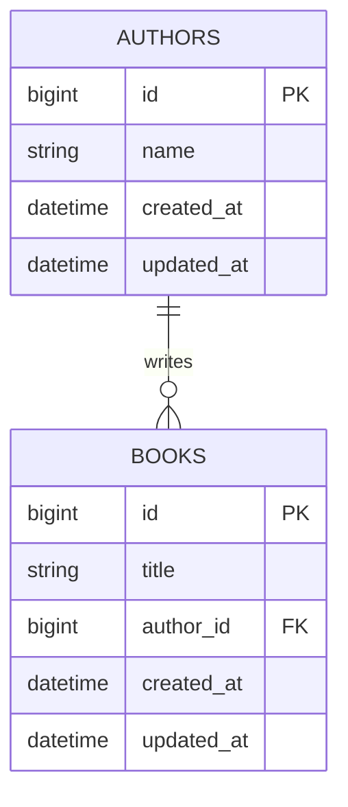
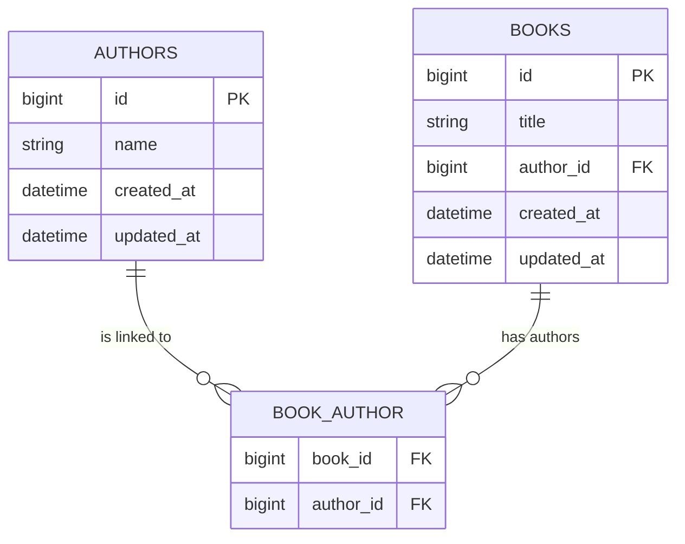

# web-developer-assignment-prior
Code base for the solution of the web developer assignment.

# Setup enviroment
## Requirements
- [Docker](https://docs.docker.com/install)
- [Docker Compose](https://docs.docker.com/compose/install)

## Setup
1. Clone the repository.
1. Start the containers by running `docker-compose up -d` in the project root.
1. Install the composer packages by running `docker-compose exec laravel composer install`.
1. Access the Laravel instance on `http://localhost` (If there is a "Permission denied" error, run `docker-compose exec laravel chown -R www-data storage`).

# Enviroment
- Laravel version: Laravel Framework 6.18.0

# Goal
- Create a list of books, with the following functions,
    - Add a book to the list.
    - Delete a book from the list.
    - Change an authors name
    - Sort by title or author
    - Search for a book by title or author
    - Export the the following in CSV and XML
        - A list with Title and Author
        - A list with only Titles
        - A list with only Authors

# Implementation plan
## DB Design

### ER Schema

### Notes:
- Authors primary key is an id
    - integration idea: now is a incrementing int but it could be turn in a more unique ID such a GUID

<aside>
💡
Possible integration idea: allow books to have more authors.
</aside>

### Example DB Design
