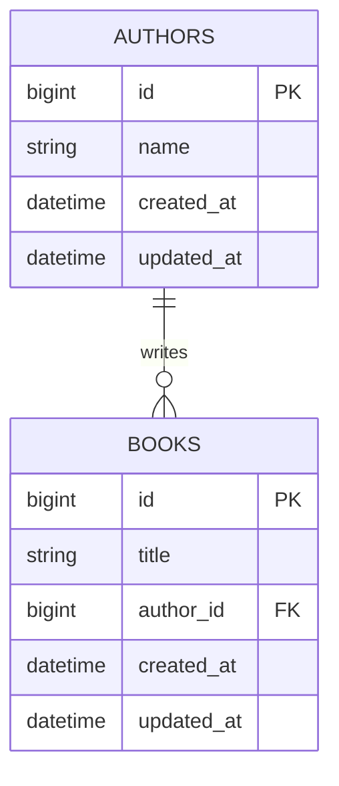

# Web Developer Assignment – Book Library

This is a complete Laravel 6 + Livewire 1.x web application for managing a personal book library.

It includes:

* Full CRUD for books and authors
* Sorting and searching
* Inline editing
* CSV/XML export functionality
* Full test coverage
* Simple minimal design

---

## Requirements

* [Docker](https://docs.docker.com/install)
* [Docker Compose](https://docs.docker.com/compose/install)

---

## Getting Started

### First-Time Setup

```bash
git clone <repository-url>
cd web-developer-assignment-prior
docker-compose up -d
docker-compose exec laravel composer install
docker-compose exec laravel php artisan migrate
```
> Optional: if you would like to have some test data run:
> `docker-compose exec laravel php artisan db:seed `

> If you encounter permission issues:
> `docker-compose exec laravel chown -R www-data storage`

Access the app at: [http://localhost](http://localhost)

---

### No Setup Startups

```bash
docker-compose up -d
docker-compose exec laravel composer install # Optional
```

---

## Features

*  Add, delete, and update books titles and authors names
*  Inline editing in Livewire table
*  Smart duplicate handling
*  Global and per-book author editing
*  Sort by title or author (A-Z / Z-A)
*  Live search filtering
*  CSV & XML export with preview feature

  * Titles and Authors
  * Titles only
  * Authors only

---

## Database Schema

### ER Diagram



> Future integration idea: allow books to have multiple authors (via pivot table).

---

## Implementation Highlights

* **Livewire 1.x** for fast, reactive UI
* **Service-oriented architecture** (`BookService`, `AuthorService`, etc.)
* **Editor Handlers** using the `FieldEditor` interface
* **Custom export strategy** with `ExportGenerator` interface
* **Enums** for type safety (`SortField`, `ExportType`)
* **AppServiceProvider** manages handler bindings
* **Form validation** and custom error messaging
* **Full test suite** with PHPUnit + SQLite in-memory DB

---

## How to Add an Editable Field

1. Add column/table via migration
    ```cmd
        // laravel command to create migration in docker
    ```
2. Create a new `FieldEditor` class:

   * Example: `BookCategoryEditor`
3. Implement `updateField(int $id, string $field, $value): void`
4. Register in `AppServiceProvider`
5. Add condition to `BooksTable::saveEdit()` switch:

   ```php
   case 'book-category':
       $handlerKey = 'editable.book-category';
       break;
   ```
6. Update `BooksTable.blade.php` and `isEditing*` methods if required

---

## Export Feature Design Decision

Export functionality (CSV/XML) is **synchronous by design** to match the scope of this application.

* Simplifies the setup (no queue workers or job retries)
* Keeps the code base light and maintainable
* Suitable for expected small-to-medium datasets

For larger applications or high-volume exports, this logic can be moved to **queued jobs** and background workers using Laravel Queues and Redis.

---

## Test Coverage

Tests run with an isolated **SQLite in-memory database** to ensure safety and speed.

To run tests:

```bash
docker-compose exec laravel vendor/bin/phpunit
```

### Coverage Matrix

| Area                           | Type    | Status    | Description                                           |
| ------------------------------ | ------- | --------- | ----------------------------------------------------- |
| **Models**                     | Unit    | ✅ Covered | Book model logic tested (`isDuplicateTitleForAuthor`) |
| **Services**                   | Unit    | ✅ Full    | Book & Author CRUD, filters, sort                     |
| **Field Editors**              | Unit    | ✅ Full    | Title edits, author merging, per-book changes         |
| **Export Generators**          | Unit    | ✅ Full    | CSV & XML export generators                           |
| **Export Service**             | Unit    | ✅ Full    | Dynamic content + file path creation                  |
| **Livewire: BookForm**         | Feature | ✅ Full    | Form validation, creation, event emit                 |
| **Livewire: BooksTable**       | Feature | ✅ Full    | Edit, delete, validation, sorting                     |
| **Livewire: ExportBar**        | Feature | ✅ Full    | Toggle options, preview, download events              |
| **Livewire: ToolBar**          | Feature | ✅ Full    | Search, sort toggling, reset                          |
| **Livewire: LibraryManager**   | Feature | ✅ Covered | Sort + search event relay                             |
| **Controller: ExportDownload** | Feature | ✅ Full    | File return, MIME headers, 404, auto-delete           |
| **Contracts & Interfaces**     | —       | ✅ N/A     | Stateless definitions                                 |
| **Providers/Bindings**         | —       | ✅ N/A     | Tested indirectly via feature + unit coverage         |

---

## Future integration ideas

* Add user login → user-scoped libraries
* Pagination support on the table
* Import data from CSV/XML support
* Async export via Laravel Queues
* Refactors alerts with personalized dialogues

---


- still to do:
    - alerts UI
    - user feedback on edit/delete
